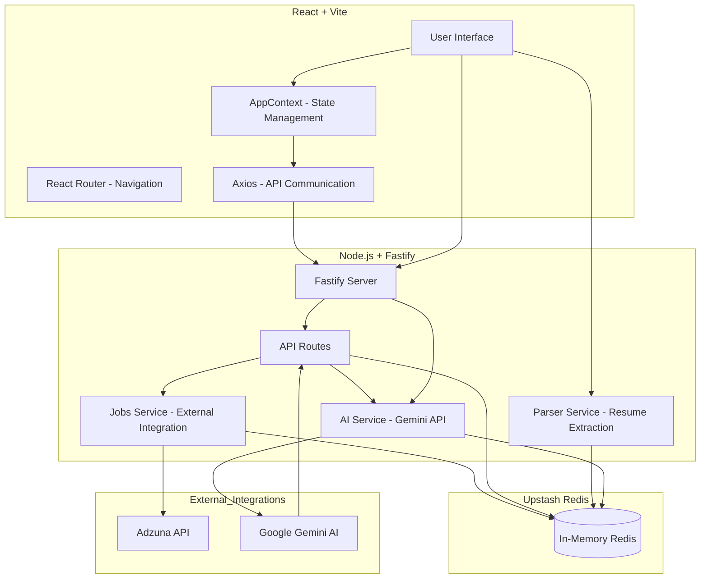

# IntelliHire AI - Technical Architecture

## System Overview
IntelliHire AI is a specialized job tracking and matching platform designed for modern job seekers. It leverages AI to bridge the gap between static resumes and complex job descriptions.

## Core Features
- **Job Discovery**: Integrated with Adzuna API with smart local caching.
- **AI Matching**: Hybrid keyword + LLM contextual scoring.
- **Smart Tracking**: Unique "Did you apply?" popup flow to ensure data accuracy.
- **AI Sidebar**: Context-aware assistant for filtering and product help.

## Technical Decisions
- **Fastify**: Chosen for its high performance and low overhead.
- **Upstash Redis**: Used for ephemeral, serverless storage of chat sessions, match results, and application states for the demo.
- **Gemini 1.5 Flash**: Optimized for speed and cost-efficiency in scoring multiple jobs.

## Critical Thinking: Smart Popup Flow
The "Apply" action in job boards is often a false positive (users click but don't finish the application).
- **Solution**: We detect the user's return to the application and trigger a confirmation.
- **Edge Cases**:
    - User clicks but closes the tab immediately.
    - User forgets to confirm (we keep the state until the next interaction).
    - User applies later (we provide an "Applied Earlier" option).
