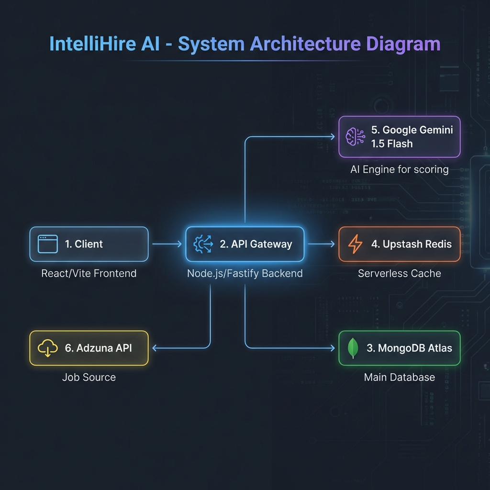

# IntelliHire AI 🚀

IntelliHire AI is an intelligent job search and matching platform that helps users find their dream jobs using AI-powered resume analysis. It features automatic job scoring, semantic search, and an interactive AI assistant.


## 🏗️ Architecture

The system follows a modern microservices-inspired architecture:



*   **Frontend**: React (Vite) + Tailwind CSS for a responsive, high-performance UI.
*   **Backend**: Node.js + Fastify for a lightweight, fast API gateway.
*   **Database**: MongoDB (Atlas) for persistent user profiles and application tracking.
*   **Cache**: Upstash Redis for caching job results and match scores (Serverless).
*   **AI Engine**: Google Gemini 1.5 Flash for semantic matching and chat assistance.
*   **Job Source**: Adzuna API for real-time job listings.

## 🚀 Setup Instructions

### Prerequisites
*   Node.js v18+
*   MongoDB Atlas Account (or local instance)
*   Upstash Redis Account
*   Google Gemini API Key
*   Adzuna API Credentials

### Environment Variables
Create a `.env` file in the `backend` directory:
```env
PORT=5000
ADZUNA_APP_ID=your_id
ADZUNA_APP_KEY=your_key
GEMINI_API_KEY=your_gemini_key
UPSTASH_REDIS_REST_URL=your_upstash_url
UPSTASH_REDIS_REST_TOKEN=your_upstash_token
MONGO_URL=your_mongo_connection_string
JWT_SECRET=your_jwt_secret
```

### Running Locally

1.  **Clone the repository:**
    ```bash
    git clone https://github.com/Bharath-Kumar-K-0930/IntelliHire-AI.git
    cd IntelliHire-AI
    ```

2.  **Install Backend Dependencies:**
    ```bash
    cd backend
    npm install
    npm start
    ```

3.  **Install Frontend Dependencies:**
    ```bash
    cd frontend
    npm install
    npm run dev
    ```

4.  **Open Browser:**
    Navigate to `http://localhost:5173`

## 🧠 AI Matching Logic

Our matching engine (`scoreJob`) uses a hybrid approach for efficiency and accuracy:

1.  **Resume Parsing**: We extract text from PDF resumes using `pdf-parse`.
2.  **Keyword Extraction**: We identify key technical skills (e.g., React, Node, Python) from the resume.
3.  **Semantic Analysis**:
    *   We send the *Resume Summary* and *Job Description* to Google Gemini.
    *   The AI evaluates the fit based on skills, experience level, and domain relevance.
    *   It returns a **Match Score (0-100)** and a **Reasoning String**.
4.  **Caching**: Scores are cached in Redis to prevent re-calculating matches for the same job-user pair, significantly reducing API costs and latency.

## 💡 Design Decisions & Critical Thinking

### 1. Smart Application Tracking (Popup Flow)
*   **Problem**: We can't track what users do *outside* our app (e.g., on the company's career page).
*   **Solution**: We use a "Smart Popup" that triggers when the user returns to the IntelliHire tab after clicking "Apply".
*   **Edge Cases**: 
    *   *User blocks popups*: The UI is non-intrusive (in-app modal, not window alert).
    *   *User applies later*: They can manually update status in the Dashboard.

### 2. Job Feed Optimization
*   **Decision**: We fetch purely relevant jobs first using API queries (Location, Role) before applying heavy AI scoring.
*   **Trade-off**: Scoring *every* job in the world is impossible. We score the top 20-50 relevant results to balance performance and quality.

## 📈 Scalability

*   **100 Jobs**: The current in-memory processing + Redis caching handles this effortlessly. Match scores are computed in parallel batches.
*   **10,000 Users**:
    *   **Stateless Backend**: Fastify is stateless; we can horizontally scale the backend instances.
    *   **Database**: MongoDB handles user data scale well.
    *   **Caching**: Redis offloads 90% of read operations for repeated job searches.
    *   **AI Rate Limits**: For 10k users, we would implement a task queue (BullMQ) to process AI scores asynchronously rather than blocking the request.

## ⚖️ Tradeoffs & Future Improvements

1.  **Real-time vs. Cached**: Currently, we rely heavily on caching. *Improvement*: Webhooks to invalidate specific cache keys when new jobs are posted.
2.  **Resume Parsing**: Simple text extraction can miss formatting nuances. *Improvement*: Use a dedicated Resume Parsing API (e.g., Affinda) for better structured data.
3.  **Auth**: Basic JWT auth is implemented. *Improvement*: Add OAuth (Google/GitHub) for friction-less onboarding.

---
Built with ❤️ by [Bharath Kumar K](https://github.com/Bharath-Kumar-K-0930)
